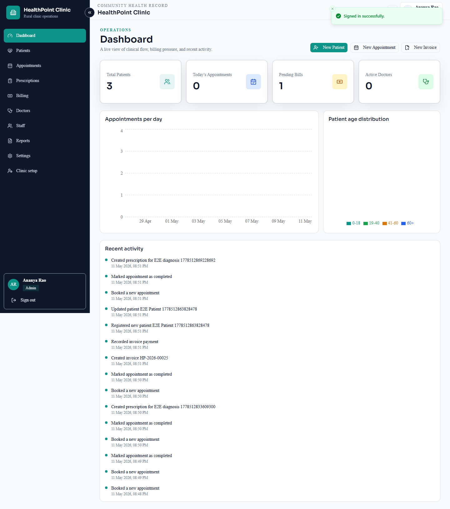
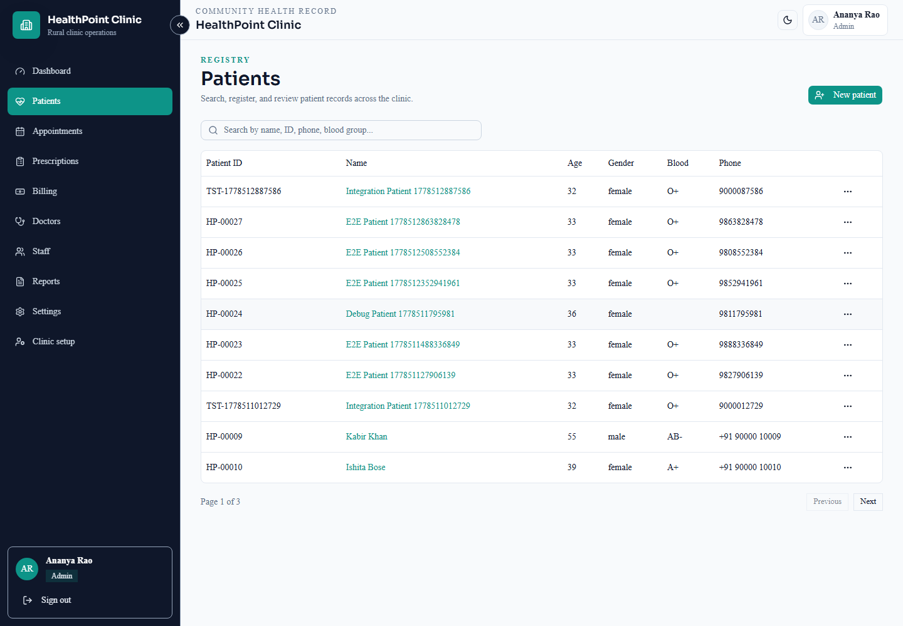
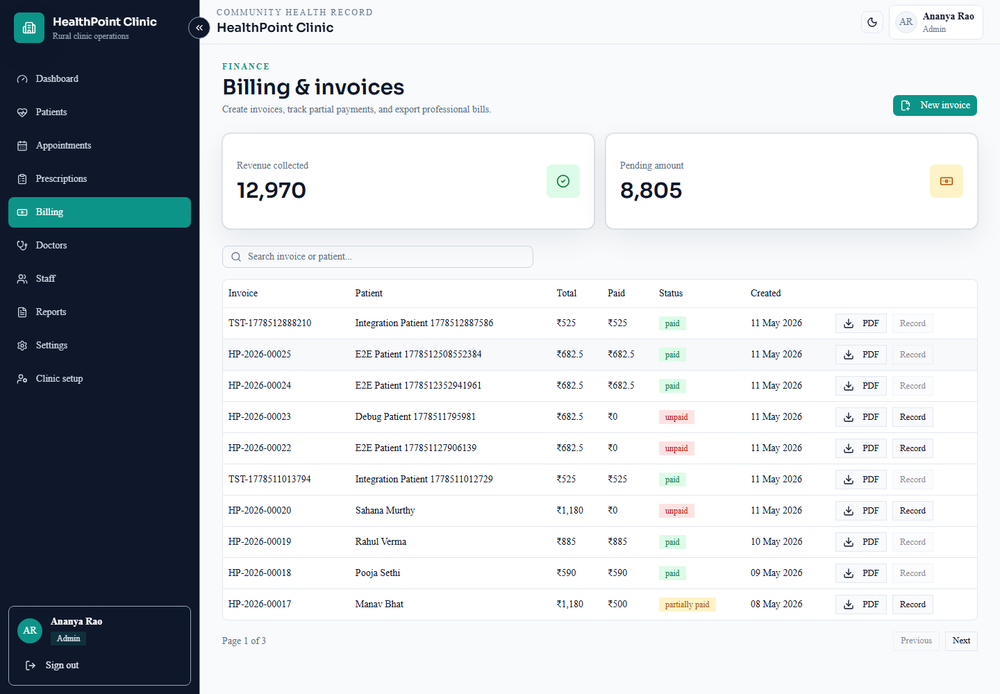
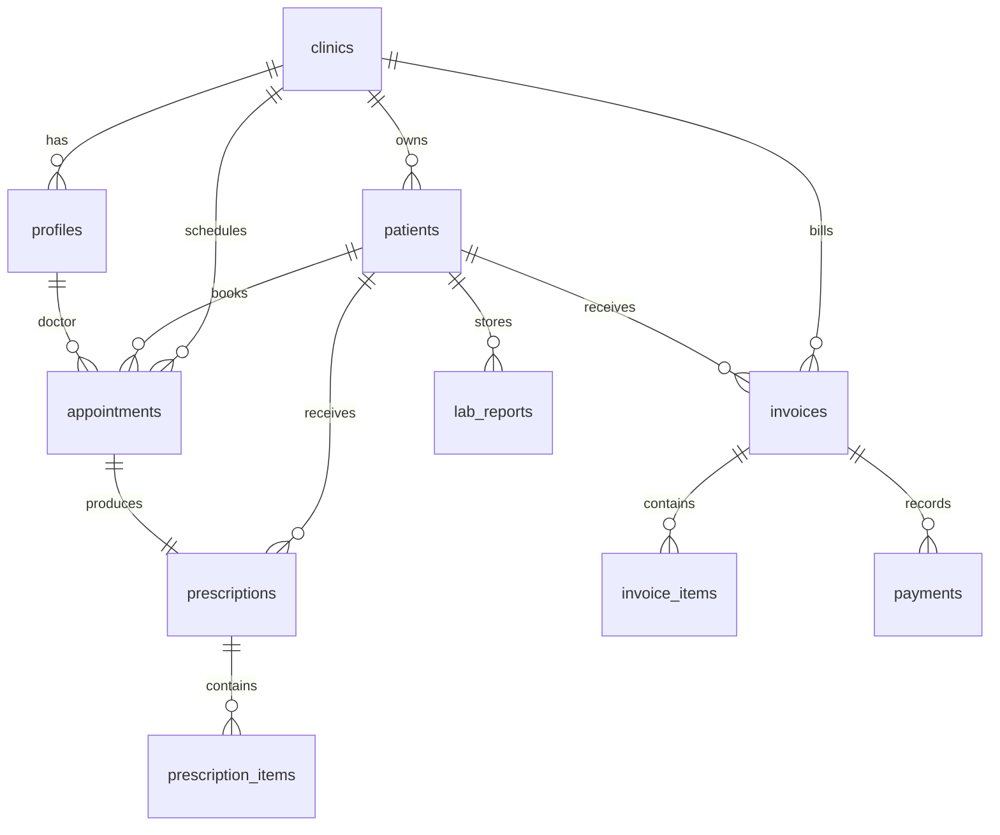

# Community Health Record System


A full-stack clinic operations system for small clinics and rural health centers.

**Live Demo:** [deployed Vercel URL]

## Features

- 🧑‍⚕️ Patient registry with search, pagination, profile photos, detail tabs, lab reports, and PDF summaries
- 📅 Appointment booking with doctor conflict detection and status workflows
- 💊 Prescription creation with medicine items and downloadable PDFs
- 🧾 Billing, invoices, payments, tax calculation, and branded invoice PDFs
- 🔐 Role-based access for Admin, Doctor, and Receptionist users
- 🗄️ Supabase Auth, RLS-protected PostgreSQL data, and Storage uploads
- 🌗 Responsive premium SaaS UI with fixed sidebar, dark mode, charts, sheets, skeleton-ready states, and Sonner toasts

## Tech Stack


## Screenshots





## Demo Credentials

| Role | Email | Password |
| --- | --- | --- |
| Admin | `admin@healthpoint.com` | `Demo@1234` |
| Doctor | `doctor@healthpoint.com` | `Demo@1234` |
| Receptionist | `reception@healthpoint.com` | `Demo@1234` |

## Local Development

```bash
npm install
cp .env.example .env.local
npm run build
npm run dev
```

Required environment variables:

```bash
NEXT_PUBLIC_SUPABASE_URL=
NEXT_PUBLIC_SUPABASE_ANON_KEY=
SUPABASE_SERVICE_ROLE_KEY=
```

Apply the SQL migration in `supabase/migrations`, then seed demo data:

```bash
npx ts-node --project tsconfig.scripts.json scripts/seed.ts
```

## Testing

```bash
npx jest --coverage
npm run test:integration
npx playwright test --reporter=html
npm run build
```

Latest local validation:

- Jest coverage: 91.86% statements across validation, permissions, date, and invoice utilities
- Supabase integration: 5/5 passing with live RLS checks
- Playwright E2E: 10/10 passing
- Lighthouse desktop on `/login`: Performance 100, Accessibility 96, Best Practices 100, SEO 91

## Database Schema



## License

MIT
